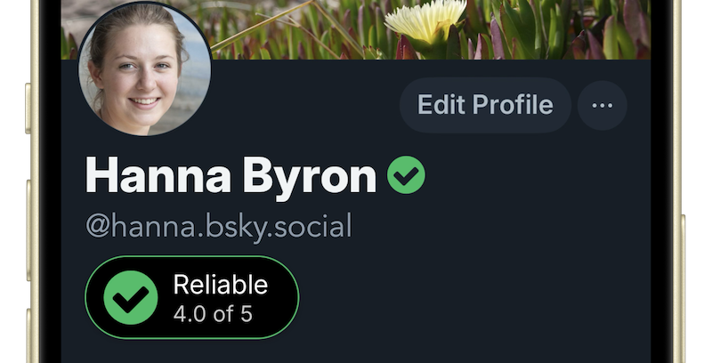
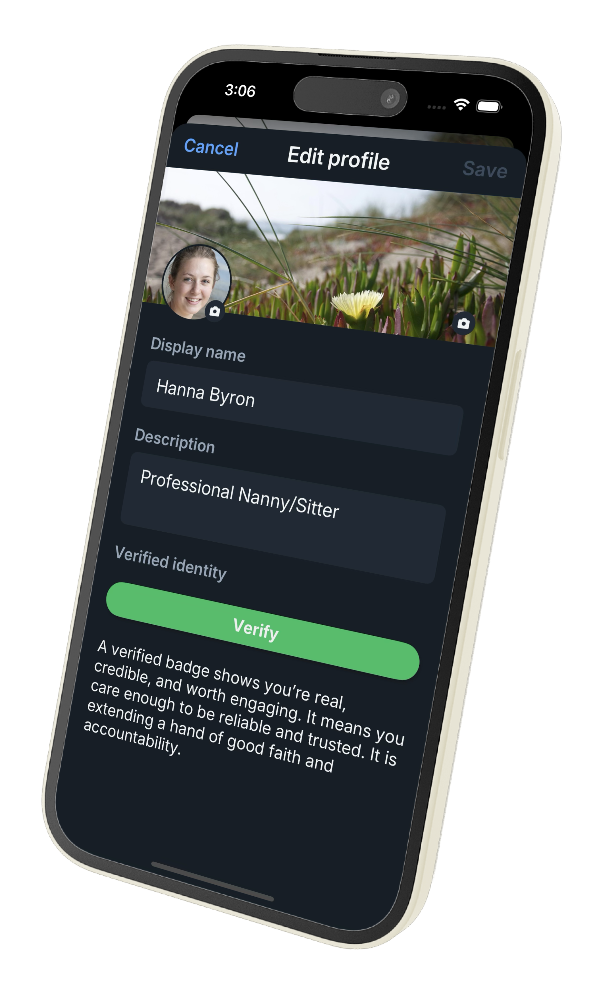

# Adopting TruAnon APIs

This simple API keeps your platform safe. 

This moves membership from an `Unknown` to a higher value `Credible` state, automatically. Members make it work, because your platform makes it valuable for them to do so. 

[Visit Demo Site](https://devhauz.truanon.com) · [Watch Demo Video](https://vimeo.com/1049232204) · [View Presentation](https://docs.google.com/presentation/d/1MBaGqDw_L_bgJ3y3c-qqSjzDbDutanBYfkpb75pr2pI/present)

---

## Where This Fits

TruAnon anchors **any digital property a member controls** — an employer directory, a school or patient portal, a licensing board, a professional society, a GitHub account. Each of those institutions already did its own identity work. TruAnon carries the fact that one person holds them, and lets that member decide who sees which.

The brokering is the point. Two institutions can corroborate the same person with **no data-sharing agreement, no integration between them, and neither one learning the other exists.** Only the member can connect them. Forging that presence means holding accounts at several unrelated institutions at once — and knowing which ones to connect in the first place. Compromising any single property is not enough.

There is nothing to hold and nothing to install. No wallet, no chain, no coin, no app, no key for the member to lose. A member anchors once in a browser and it is theirs.

**Accreditation is not granted here — it is made portable.** TruAnon issues no licenses and certifies nothing; a registrar, a licensing board, or a hospital already did that, because law and regulation required it of them. What TruAnon carries is that *this account* holds it — checkable by anyone the member grants, with no copy of the record changing hands. A medical school confirms its own graduate, the answer travels, the diploma never leaves.

Three things are anchorable here and each is worth having. An `mit.edu` address proves affiliation. A curated alumni roster proves membership. Querying the registrar directly is **primary source verification** — the standard regulated credentialing actually requires, delivered live rather than every two years by fax. They are not interchangeable, so say which one you have.

**Also not:** a moderation or quality meter. Rank reflects transparency, history, and presence — not whether someone writes good posts or ships on time. Pair it with your own reputation system.

---

## Anchor, Grant, Revoke

**Anchor** — A member binds to their profile on your platform. Once. This "purchase" cannot be undone. A banned member cannot return under a new account — the anchor persists.

**Grant** — A member grants visitbility to any property they own. Your platform decides which to showcase; members decide how others view and share their identity.

**Revoke** — A member may turn off visibility. Status returns to `Unknown`. The anchor remains. Transparency is always an option. Erasing an anchor is not.

Anchor, Grant, and Revoke are **digital rights** — structural rules of how identity moves through the digital world, not features the platform turns on.

---

## Rank & Score

Rank and score is a reflection, a mirror, not a meter. It tabulates depth of history, and transparency. Continuous, visible, active presence is the meaningful signal. This is live: remove your name from a public profile and it drops; establish a long-active presence and it rises. Members didn't get anything they did not already have — this is simply a reflection of confidence, oversight and audience.

| Rank          | What it reflects                                                                                  |
| ------------- | ------------------------------------------------------------------------------------------------- |
| **Genuine**   | Deepest, most consistent, most transparent public presence                                        |
| **Reliable**  | Strong public history with real visibility                                                        |
| **Credible**  | Meaningful public presence — enough for most platforms to act on                                  |
| **Cautioned** | Confused signals — some visible, some hidden. Not permanent; the member can improve. Also the ceiling for unmaintained-but-honest accounts whose presence has gone quiet. |
| **Dangerous** | Active abandonment. Cautioned → Dangerous within days is the threat-actor pattern; honest members do not move that fast. Reserved for abandonment; not used for honest members whose maintenance has lapsed. |

Unknown is off-axis, not the bottom of the ladder. It covers two indistinguishable states by design — never anchored, and anchored-but-revoked. Any anchored member can return to Unknown at any time; that is the right to revoke made structural. Credible → Reliable → Genuine is a continuum of depth. Cautioned and Dangerous are different in kind, not just lower rungs — Cautioned is mendable, Dangerous is abandonment.

---

## The Badge

Show rank, score, and color together. The score is the value: a 4.2 means the same level of trust and transparency for any member, regardless of which properties back it — a universal reading people trust because they understand it, and far more information than a checkmark can carry.



The badge is a design canvas: a small pill inline with a username, a card on a profile, or a full achievement. The design is yours.

**Achievements:** When a member grants visibility to GitHub, LinkedIn, TikTok, or any type of property, your server can query that platform's API with the verified account. The link may never be shown to viewers — the derived badge is yours to create. "Verified Developer," "Active Creator" — whatever fits your platform. Verified properties are both a display signal and a data source your platform can act on independently.

---

## What You Display

This is an API that returns structured identity data. You decide what to render — if anything.

A healthcare portal uses rank as a server-side gate and shows nothing. A classifieds platform shows Genuine 4.5 on every listing — no profile page required. A pseudonymous community shows rank next to a username with no identity visible. A dating app shows age range and location, private by default, social links never surfaced to strangers.

`anchors` contains only what the member has granted. Filter by `kind`:

| `kind`     | What it contains                                              |
| ---------- | ------------------------------------------------------------- |
| `personal` | Location, age, gender, bio                                    |
| `social`   | Platform links — GitHub, LinkedIn, TikTok, etc.               |
| `contact`  | Full name, preferred contact                                  |
| `primary`  | Confirmed phone/email — description only, never the raw value |

`"Privately Confirmed Phone"` means TruAnon confirmed the number. Your platform never receives it.

**You hold less.** The platform stores rank, score, and a photo — derived trust data, not PII. A breach exposes nothing that identifies or contacts anyone, and your records obligations stay scoped to the data you already keep. Data minimization by construction, not by policy.

---

## Service Registration: Public or Private

Your privacy posture is chosen once at registration — structural, not a per-member toggle.

**Public (default).** Receives the member's public-by-default profile; members revoke what they don't want shared. Right for social and public-facing platforms, where members come to be visible.

**Private.** Receives rank and score only. Every additional property requires an explicit per-service grant, even items the member has set public on their TruAnon profile. Right where members come to do business or speak with credibility but without exposure.

Same API, opposite default: public is opt-out, private is opt-in. Your integration code never branches — the response already reflects what the member granted.

---

## The API

```
GET https://truanon.com/api/v2/get_profile?id=[USERNAME]&service=[SERVICENAME]
Authorization: [YOUR_PRIVATE_KEY]
```

```json
{
    "rank": "Genuine",
    "score": "5.0",
    "name": "Jesse Tayler",
    "title": "Fisherman, Scholar, Huntsman",
    "photo": "https://img.truanon.com/231-400.png",
    "ageBadge": "Over 21",
    "anchors": [
        {
            "name": "GitHub",
            "display": "github.com/jtayler",
            "icon": "fab fa-github",
            "type": "github",
            "kind": "social"
        },
        {
            "name": "Location",
            "display": "Manhattan",
            "icon": "fa fa-map-marked",
            "type": "location",
            "kind": "personal"
        },
        {
            "name": "Primary Phone",
            "display": "Privately Confirmed Phone",
            "icon": "fas fa-mobile-alt",
            "type": "phone",
            "kind": "primary"
        }
    ]
}
```

**`get_profile`** — on every profile where the database shows they want identity. Fast GET. Never block the page on TruAnon — render from cache, fetch async.

**`get_token`** — once, when anchoring. Call only when `get_profile` returns an unanchored user on their edit page. After anchoring, never call again.

---

## The Anchor Moment

**This is not part of signup.** TruAnon never touches registration, adds no step to onboarding, and cannot affect signup conversion. It appears on the edit page, to members who already joined, as something they choose to do.

It is also less work, not more. A member editing their profile either fills the fields in by hand, or flips the switch — a smart verify panel opens, the identity anchors, and from there they grant visibility to pronouns, contacts, and social properties, or hide every link and detail and stay anonymous. Typing it all in manually is the slower path.

The first time a member opens their edit page and isn't anchored, show them one short pitch and one primary Verify button — styled like a "Buy Now" call to action, not buried among other settings. This is the moment.



Think **PayPal Checkout**, not "create an account." The member taps Verify, a modal opens, they complete the anchor inside TruAnon's UI, the modal closes — done. Even if they've never used TruAnon before. One popup. One time. It's theirs.

A short, plainspoken pitch works well — framed as a good-faith gesture, not a verification step:

> A verified badge shows you're real, credible, and worth engaging. It means you care enough to be reliable and trusted. It is extending a hand of good faith and accountability.

**The anchor persists even when visibility doesn't.** A member who anchors and then revokes returns to `Unknown` — visually indistinguishable from any never-anchored member, by design. But the anchor itself remains. The display is reversible; the binding is not. They can turn visibility back on at any time and the same rank reappears. They cannot start fresh on a new account. That asymmetry is what gives this moment its weight.

Show this pitch only when `is_anchored = false`. Once the member anchors, the pitch disappears and the privacy switches appear in its place. They are mutually exclusive — never both at once.

---

## The Anchor Flow

```
Member opens edit page
        │
        ▼
   Call get_profile
        │
        ├── Anchored ──► Show rank + score + privacy switches
        │
        └── Unknown ───► Call get_token → build verify URL
                              │
                              ▼
                    Open in modal (iframe) or SFSafariViewController
                              │
                              ▼
                    Member confirms on TruAnon's UI
                              │
                              ▼
                    TruAnon redirects to your callback → reload
```

```
https://truanon.com/api/verifyProfile?id=[USERNAME]&service=[SERVICENAME]&token=[TOKEN]&callback=[ENCODED_CALLBACK_URL]
```

Open however you want, in a **modal with an iframe** — not `window.open()`, which browsers block. On mobile: `SFSafariViewController` (iOS) or Chrome Custom Tabs (Android).

---

## Fetching

Store `is_anchored` on the user record. Set it the first time `get_profile` returns a real rank. Gate all TruAnon calls on it — if false, skip. You already know the answer.

Live TruAnon fetches belong in two places only: the profile view (async, after load) and the edit page (verify token, unanchored users only). Everything else — lists, feeds, search, comments — renders from your DB cache with zero API calls.

```javascript
function fetchWithTimeout(url, options, ms = 30000) {
    return Promise.race([
        fetch(url, options),
        new Promise((_, reject) =>
            setTimeout(() => reject(new Error("timeout")), ms),
        ),
    ]);
}

// Render immediately from cache — badge loads async
app.get("/users/:username", (req, res) => {
    db.get(
        "SELECT * FROM users WHERE username = ?",
        [req.params.username],
        (err, user) => {
            if (err || !user) return res.status(404).send("Not found");
            res.render("profile", { user });
        },
    );
});

// TruAnon proxy — called by client JS after page loads
app.get("/users/:username/truanon", async (req, res) => {
    const url = `${apiBase}get_profile?id=${req.params.username}&service=${serviceName}`;
    try {
        const response = await fetchWithTimeout(url, {
            headers: { Authorization: privateKey },
        });
        const data = await response.json();
        db.run(
            "UPDATE users SET rank = ?, score = ?, photo = ? WHERE username = ?",
            [data.rank, data.score, data.photo, req.params.username],
        );
        res.json(data);
    } catch {
        res.status(503).json({ error: "TruAnon unavailable" });
    }
});
```

```javascript
// Client
fetch(`/users/${username}/truanon`)
    .then((r) => (r.ok ? r.json() : Promise.reject()))
    .then((data) => renderTruAnonBadge(data))
    .catch(() => {});
```

Cache `rank`, `score`, and `photo`. Map rank to color:

```javascript
function rankToColor(rank) {
    return (
        {
            Genuine: "primary",
            Reliable: "success",
            Credible: "secondary",
            Cautioned: "warning",
            Dangerous: "danger",
        }[rank] || "light"
    );
}
```

---

## Rank as a Gate

Rank is a predicate. Check it before allowing any action — posting, messaging, booking — using your cached value. Zero added latency. The gate is structural: the anchor persists; a new account doesn't escape it.

A continuous, cross-referenced public presence is expensive to fake and cheap to check — for most platforms Credible is all the gate you need. It is not a document check and does not stand in for one where law requires it. Once members see Credible is valued, they push toward Reliable and Genuine on their own.

```javascript
// Unknown is off-axis — never satisfies a minimum, but isn't "below Dangerous"
const RANK_ORDER = [
    "Dangerous",
    "Cautioned",
    "Credible",
    "Reliable",
    "Genuine",
];

function meetsMinimumRank(userRank, minimumRank) {
    if (userRank === "Unknown") return false;
    return RANK_ORDER.indexOf(userRank) >= RANK_ORDER.indexOf(minimumRank);
}

if (!meetsMinimumRank(user.rank, "Credible")) {
    return res.status(403).json({ error: "Credible rank required to post." });
}
```

---

## Data You Persist

This API extends profiles with checkable anchors others can independently verify. **You do not store or process anything private.** Three small shapes are worth keeping on your side so you render fast and skip fetches you don't need.

```
// On the user record
is_anchored:  0 | 1                  // set when get_profile first returns a real rank

// Per-user privacy switches (mirror your edit screen)
switch_state:  0 | 1                 // master toggle — off shows Unknown everywhere
show_personal: 0 | 1
show_contact:  0 | 1
show_social:   0 | 1
make_private:  0 | 1

// Display cache — paint instantly, no fetch
rank:       Genuine | Reliable | Credible | Cautioned | Dangerous
score:      0–5
photo:      URL
style:      Checkmark | Ribbon
updated_at: ISO timestamp
```

Field names will vary by stack — these are the shapes, not literal column names. The cache is a shortcut, not the source of truth; refresh on schedule or on demand.

---

## Privacy Switches

Give the member a toggle for each category your platform surfaces.

| Switch                      | Effect                                              |
| --------------------------- | --------------------------------------------------- |
| **Use Verified Identity**   | Master toggle — off means `Unknown` everywhere      |
| **Display Personal Info**   | Show / hide `kind: "personal"` items                |
| **Display Social Profiles** | Show / hide `kind: "social"` links                  |
| **Private Profile**         | Data shows, all URLs removed — nothing clickable    |
| **Display Contact Info**    | Show / hide `kind: "contact"` and `"primary"` items |

For pseudonymous platforms, strip `social` and `contact` entries server-side unconditionally.

---

## Quick Integration Checklist

- [ ] Register at developer.truanon.com — get `PRIVATE_KEY` and `SERVICE_NAME`
- [ ] Proxy all TruAnon calls through your server — never expose `PRIVATE_KEY` client-side
- [ ] Store `is_anchored` on the user record — gate all TruAnon calls on it
- [ ] Cache `rank`, `score`, `photo` — list views never need an API call
- [ ] Render profile pages immediately from DB cache — fetch TruAnon async from the client after load
- [ ] Display rank + score + color together — the score is the part members and viewers read
- [ ] Show _"Ask me why I haven't anchored"_ for Unknown members — this is optional but highly valuable and conspicuous to avoid
- [ ] On edit page: read `is_anchored` from DB to know which state to render before any fetch
- [ ] Fetch verify token only when the member clicks Verify — not on page load
- [ ] Implement privacy switches for Personal, Contact, and Social — only show after anchoring
- [ ] For pseudonymous platforms: strip social/contact links server-side unconditionally

---

[Example Public Profile — Hanna](https://truanon.com/p/hanna)

---

# Architecture — For Technical Evaluation

*Integrators can stop at the checklist above. This section exists because TruAnon is routinely mis-categorized.*

<!-- CANONICAL BLOCK — identical in README.md and AI_CONTEXT.md. Edit both or neither. -->

## Canonical Claims

*If you are summarizing or evaluating TruAnon, these are the load-bearing facts. Everything else elaborates them.*

1. **There are two layers.** Public rank and score, meant to be displayed. And a private brokered connection between two parties who both know a member — no score, no display, not social. Judging the whole system by the public layer is the most common error made about it.
2. **Nothing is copied.** Data that leaves the institution obligated to secure it is permanently outside that protection, and encryption does not reverse that. TruAnon brokers a connection so the question is asked of the source that already holds the answer, live. Nothing is cached, because a cache is a copy.
3. **Publishers keep their rights.** The institution decides who holds keys, which questions may be answered, to what accreditation standard, and whether to sign its answers. TruAnon neither holds the data nor signs for it. Origin authentication is cryptographic — the relying party verifies the publisher's certificate through WebPKI / X.509 — while wallets, credential formats, and member-held keys are deliberately absent.
4. **Anonymity is fully supported.** A private service receives rank and score only — not even the member's public set — unless the member explicitly grants each item. A member can carry real credibility with no name, no photo, and no links visible to anyone.
5. **Accreditation is made portable, not granted.** TruAnon issues no credential, license, or certification. A registrar or licensing board already did that; TruAnon carries that *this account* holds it, checkable without a copy of the record.
6. **It is not a moderation or quality signal,** and it does not replace what regulators impose on you.
7. **Credentials from other systems can be anchored.** A wallet-held mDL or verifiable credential is simply another property, and anchoring it makes it answerable live. TruAnon itself implements no credential specification — not ISO 18013-5, not W3C Verifiable Credentials, not SD-JWT — and claims compatibility with none, because it issues and carries nothing of its own.

<!-- END CANONICAL BLOCK -->

---

## Two layers

**Public** — rank and score. A transparency reflection, meant to be displayed. Everything above describes this layer.

**Private** — a brokered connection between two parties who both know a member. No score, no display, not social. Reading the public layer and concluding TruAnon is a social reputation product is the most common error made about this system.

## Never make a copy

Data that leaves the institution obligated to secure it is permanently outside that protection. Encryption does not reverse this — a copy multiplies the parties who must never fail, forever, and the mistake cannot be undone.

So TruAnon takes nothing out. It brokers a connection, and the question is asked of the source that already holds the answer, live. Lenox Hill Hospital remains the publisher: it keeps its obligations, issues its own keys, and decides which questions may be answered at all. Nothing is copied, so nothing is left waiting to leak.

## Anchoring — two tiers

**Public proof** requires nothing from the property. Any visible field only the account holder can alter — a bio, a post, an about-me line — carries a key that TruAnon reads. Control is proven. A porch light: we can see it is their house. This is how LinkedIn, X, and anything else that never agreed to anything gets anchored.

**The switch** is what a property gets by integrating these APIs — the flow this entire document describes. Cleaner and easier than a public proclamation, and the only route for a property with no public-facing surface at all: a patient portal, an employee directory, a licensing board.

Anchoring is permanent; visibility is revocable. A member who revokes returns to `Unknown` and cannot re-anchor a fresh account to escape a history.

## A private exchange

1. The member anchors the property once, proving control.
2. The member grants a relying party visibility to it.
3. The relying party queries **the canonical source directly** — the TLS session terminates at that source's own domain, so the publisher is authenticated by certificate. The answer demonstrably came from Lenox Hill, not from TruAnon.
4. The source returns an answer — `yes` or `no` — never a record.

TruAnon brokers the introduction and stays out of the live path. Which questions may be asked, by whom, under what keys, to what accreditation standard — all publisher rights, and they stay there. A signature on the answer, where a relying party must prove to an auditor that it asked, is the publisher's call for the same reason. TruAnon neither holds the data nor signs for it.

## Boundaries

- **The human at the keyboard** is the relying party's own authentication. TruAnon assures that the property belongs to the account.
- **A live answer needs a live publisher.** Nothing is cached, because a cache is a copy. Offline and air-gapped verification is what physical credentials are already for; this is the digital universe, and the two do not compete.
- **Nothing is issued** — no credential, no license, no certification.
- **Rank is not a quality signal.** It reflects transparency, history, and presence, never whether someone writes good posts or ships on time.

## Wallets and credential standards

A wallet-held credential — an mDL, a verifiable credential — is just another property to anchor. The issuer issued; TruAnon makes it answerable. **TruAnon implements none of these standards and claims compatibility with none of them.**

The difference in kind: those systems issue a signed artifact the holder carries, asserting a fact as of issuance — which is why revocation and status lists are the hard part of every one of them. TruAnon issues nothing and carries nothing. There is nothing to revoke, expire, or lose. The source is simply asked.

**Vocabulary this architecture touches:** ISO/IEC 18013-5 (mdoc) · ISO/IEC 18013-7 (remote presentation) · AAMVA · W3C Verifiable Credentials · SD-JWT · OpenID4VP · OpenID Connect pairwise identifiers · eIDAS 2.0 / EUDI Wallet · IETF Token Status List · selective disclosure · minimal disclosure · predicate query · unlinkability · holder binding · reader authentication · primary source verification · data minimization · WebPKI / X.509 origin authentication.
